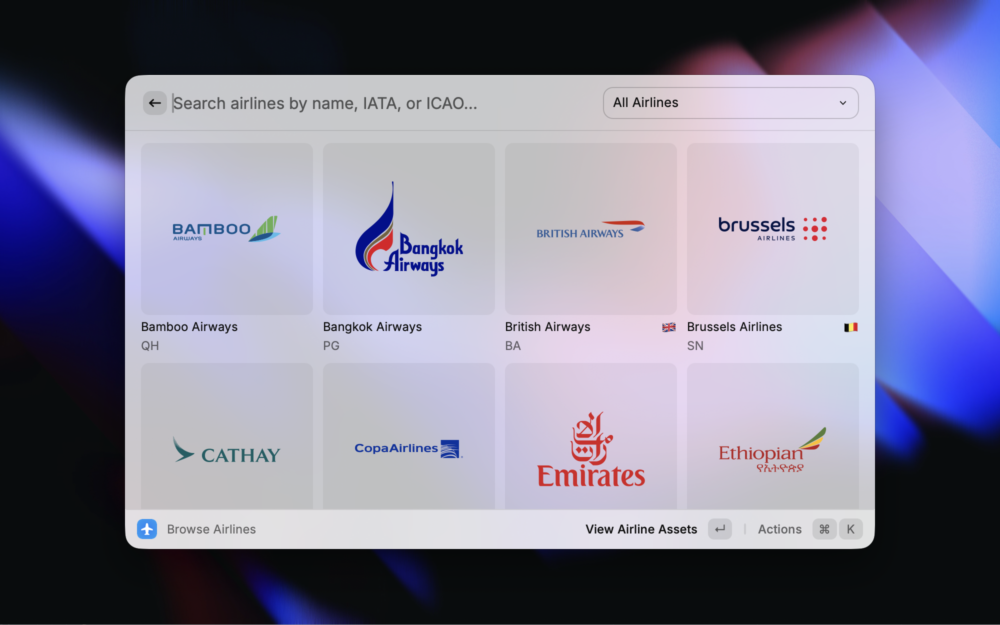

# Soaring Symbols

Browse and search a curated collection of airline branding assets — logos, icons, and tails in SVG

## Features

A fast Raycast extension for exploring airline branding assets.

- Browse curated airline logos, icons, and tails (SVG).
- Fast search and filters (name, code, alliance, flag carriers).
- SVG actions: copy, download, monochrome variants.

## Issues

Report bugs or suggest improvements by creating an issue [here](https://github.com/soaring-symbols/raycast/issues).
